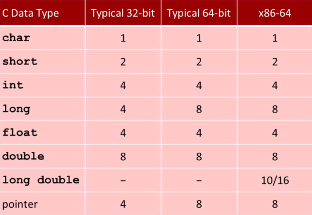
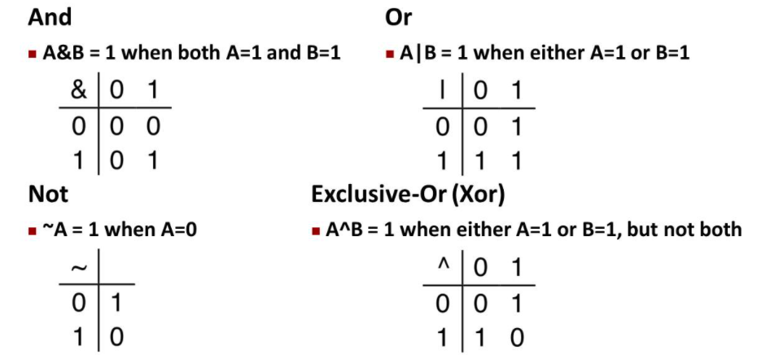
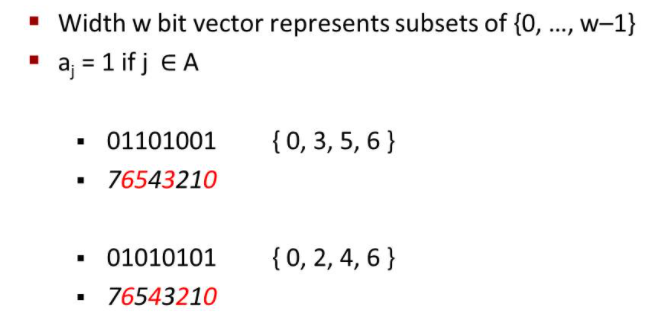
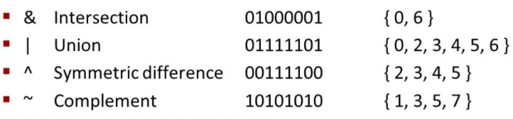
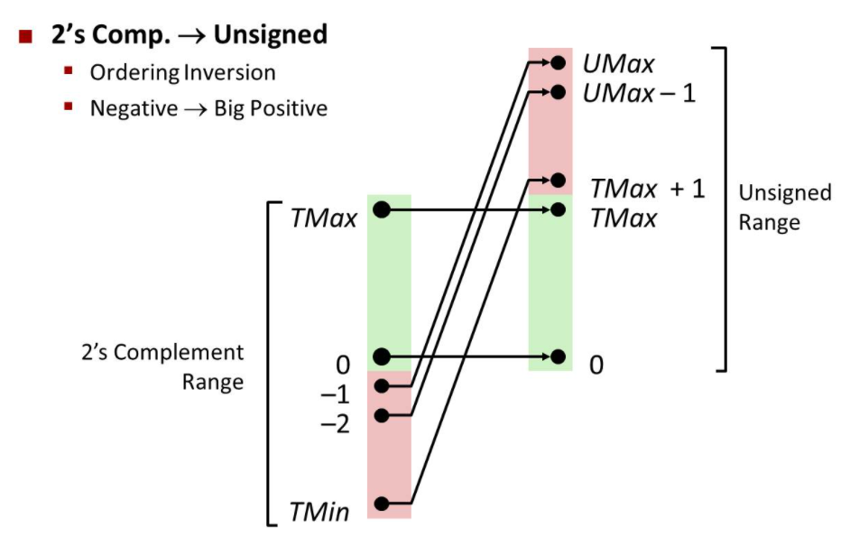

# Lecture 02 Bits, Bytes, and Integers

## Everything is bits

Bits is easy to quantify. The outside disturbance can't affect much as long as it is still in the threshold value you set for them. Finally, you can get a nice and clean signal out of it. 

-   Base 2 Number Representation
    -   15213 = 11101101101101

## Encoding Byte Values

-   Byte = 8 bits
    -   Binary 00000000 to 11111111
    -   Decimal 0 to 255
    -   Hexadecimal 00 to FF 

| Hex  | Decimal | Binary |
| ---- | ------- | ------ |
| 0    | 0       | 0000   |
| 1    | 1       | 0001   |
| 2    | 2       | 0010   |
| 3    | 3       | 0011   |
| 4    | 4       | 0100   |
| 5    | 5       | 0101   |
| 6    | 6       | 0110   |
| 7    | 7       | 0111   |
| 8    | 8       | 1000   |
| 9    | 9       | 1001   |
| A    | 10      | 1010   |
| B    | 11      | 1011   |
| C    | 12      | 1100   |
| D    | 13      | 1101   |
| E    | 14      | 1110   |
| F    | 15      | 1111   |

## Example Data Representations

## Boolean Algebra

## Example: Representing & Manipulating Sets

Computer really good at doing this. Which 1 on the bit value represents the contents in that set. 

-   Representation

-   Bit Wise Operations

## Contrast: Logic Operations in C

-   Contrast to Logical Operators
    -   AND: &&
    -   OR: ||
    -   NOT: !

Those operators **don't do** bit wise operation

## Shift Operations

Shift Operation is a bit wise operation

-   Left Shift: x << y
    -   Shift bit-vector x left y positions
-   Right Shift: x >> y
    -   Shift bit-vector x right y positions. 
-   Undefined Behavior
    -   Shift amount < 0 or $\geq$ word size

## Numeric Ranges

For m bit binary values

-   Unsigned Int
    -   Normal understanding of binary values
    -   MIN: 0
    -   MAX: $2^m-1$
-   Signed Int (One's complement) [Ones' complement - Wikipedia](https://en.wikipedia.org/wiki/Ones'_complement)
    -   The left most bit is sign bit (Most significant bit). If it is one, the value is negative. If it is zero, the value is positive. 
    -   MIN: $-(2^{m-1}-1)$
    -   MAX: $2^{m-1}-1$
-   Two's complement [Two's complement - Wikipedia](https://en.wikipedia.org/wiki/Two's_complement)
    -   Negative value representation is First flipped the bits, Then add one to it. 
    -   MIN: $-2^{m-1}$
    -   MAX: $2^{m-1}-1$
    -   It is really useful when **adding two inverses** together, for example 8 + (-8). Using two's complement representation will get 0 immediately which one's complement doesn't. 

## Conversion Visualized

Here is the visualization view of Two's complement value and Unsigned values. 

## Casting Signed & Unsigned: Basic Rules

-   Bit pattern is maintained
-   But reinterpreted
-   Can have unexpected effects: adding or substracting $2^m$
-   Expression containing signed and unsigned int
    -   int is **cast to** unsinged!!

## Expanding

When extending singed integer x, just **extend the most significant bit (sign bit)** to the extend bits. The method is the same as unsigned int, since the most significant bit is 0. 

3 = 0011 = 00000011

-3 = 1101 = 11111101

## Truncating

Truncating a unsigned value is taking mod operation. 

27 = 11011 take mod 16 ($2^n$ n is the bit number after truncating)

27 % 16 = 11 = 1011

Truncating a signed value is similar to mod. If the most significant bit is the same after truncating, the value will be the same as it was in the expanding process. 

-13 = 10011 with unsigned valued interpreted as 19, take mod 16

3 = 0011

