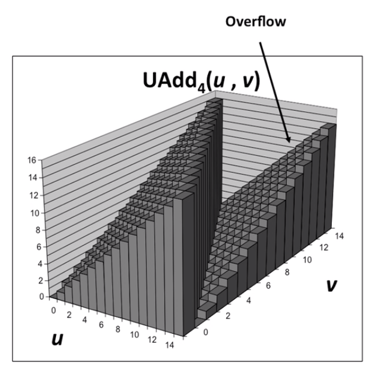
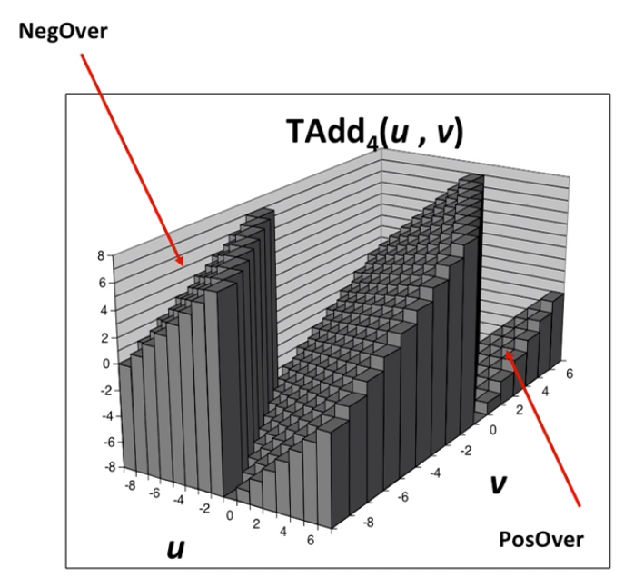
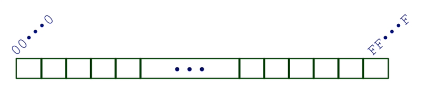
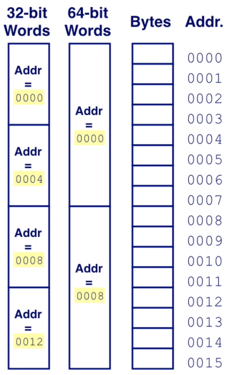
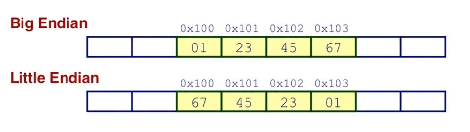
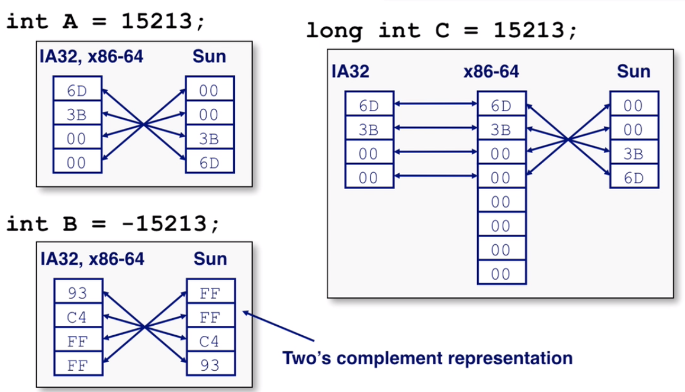
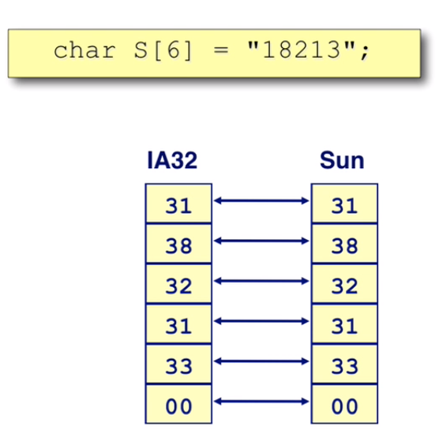
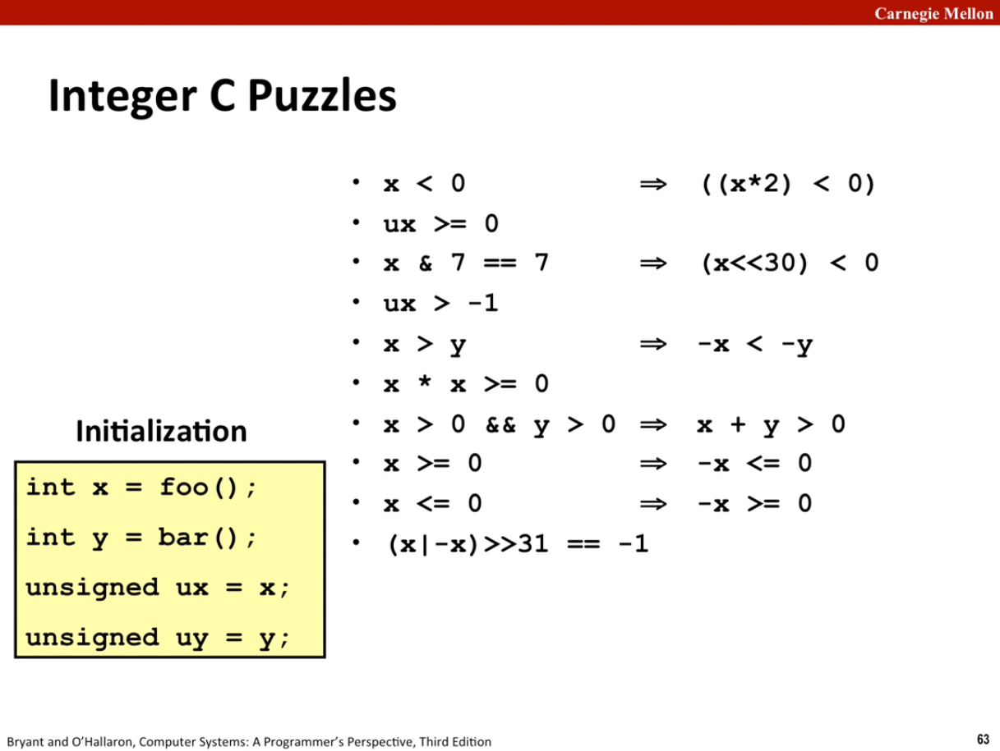

# Lecture 03 Bits, Bytes, and Integers (cont.)

## Unsigned Addition

If the addition of unsigned numbers ultimately result to have one more bit (exceed the maximum representation of the machine), we will just discard it without any notification. 

For example, for a four bit number, $w = 4$, ranging from 0~15. Suppose we have $13 + 5 = 18$, but in unsigned addition case, it will result to be a 5 bit representation, we will just discard the exceed bit and result will be $2 = 18\ \text{mod}\ 2^4$. 

```
   1101	(13)
+  0101	(5)
-------
(1)0010	(18)
   0010 (2)
```



## Two's Complement Addition

Two's complement addition is more like a "normal" addition. We also discard the "overflow bit" in the calculation. 

Same example, we take four bit number $w=4$, range from -8~7. If we want to add $-3 + 5 = 2$

```
   1101	(-3)
+  0101	(5)
-------
(1)0010	(18)
   0010	(2)
```

When the number cannot be represent in the range of the bits, it result an overflow. Weather it is a positive overflow or negative overflow. 

```
   1101	(-3)
+  1010	(-6)
-------
(1)0111	(-9)
   0111	(7)
```



## Unsigned Multiplication in C

Unsigned multiplication follow the same pattern of unsigned addition. 
$$
\text{UMult}_w(u, v)=u \cdot v \ \text{mod} \ 2^w
$$

## Signed Multiplication in C

Signed multiplication doing the same thing as the unsigned multiplication. The only difference is the interpretation of data. 

-   Ignores high order $w$ bits
-   Some of which are different for signed vs. unsigned multiplication
-   Lower bits are the same

## Power-of-2 Multiply with Shift

-   `u << k` gives $u \cdot 2^k$. 
-   Both signed and unsigned

So in **assembly code**, when we see shifting of the data, it probably doing the power-of-2 multiplication. 

## Power-of-2 Divide with Shift

-   `u >> k` gives $\left \lfloor u / 2^k \right \rfloor$
-   If the number is odd, compiler will add a bias of 1 and then do the shift. (quite similar to the procedure of adding 1 to negate a two's complement number). 
-   **Uses logical shift for unsigned division**
-   **Uses arithmetic shift for signed division**

## Arithmetic: Basic Rules

-   **Addition:**
    -   Unsigned/signed: Normal addition followed by truncate, same operation on bit level
    -   Unsigned: $\text{addition mod} \ 2^w$
        -   Mathematical addition + possible subtraction of 2^w
    -   Signed: $\text{modified addition mod} \ 2^w$ (result in proper range)
        -   Mathematical addition + possible addition or subtraction of 2^w
-   **Multiplication:**
    -   Unsigned/signed: Normal multiplication followed by truncate, same operation on bit level.
    -   Unsigned: $\text{multiplication mod} \ 2^w$
    -   Signed: $\text{modified multiplication mod} \ 2^w$ (result in proper range)

## Byte-Oriented Memory Organization



-   **Programs refer to data by address**
    -   Conceptually, envision it as a very large array of bytes
        -   In reality, it's not, but can think of it that way
    -   An address is like an index into that array
        -   and, a pointer variable stores an address. 

-   **Note: System provides private address spaces to each "process"**
    -   Think of a process as a program being executed
    -   So, a program can clobber its own data, but not that of others. 

## Machine Words

Any given computer has a "Word Size." Word Size is a nominal size of integer-valued data and of addresses.

## Word-Oriented Memory Organization

Addresses Specify Byte Locations

-   Address of first byte in word
-   Addresses of successive words differ by 4 (32-bit) or 8 (64-bit)



## Byte Ordering

So, how are the bytes within a multi-byte word ordered in memory?

**Conventions:**

-   Big Endian: Sun, PPC Mac, Internet
    -   Least significant byte has highest address
-   Little Endian: x86, ARM processors running Android, IOS, and Windows.
    -   Lease significant byte has lowest address

**Example:**





## Representing Strings

Strings in C

-   Represented by array of characters
-   Each character encoded in ASCII format
    -   Standard 7-bit encoding of character set
    -   Character "0" has code `0x30`
-   String should be null-terminated
    -   Final Character is `0x00`

Byte ordering of string is the same in different machine, no matter is is little endian or big endian. 



## Integer C Puzzles



>   Hint: one good way of finding counter example is to choose $T_{min}$, which is `100...0`. 

1.   False, positive/negative overflow
2.   True, unsigned integer is always great or equal to 0
3.   True, hexadecimal 7 is `0...0111`, so after the shift, the most significant bit is 1
4.   False, because when compare `unsigned` to `int`, it will cast both to `int`, the comparison will fail. 
5.   False, the negative of $T_{min}$ is still $T_{min}$. So if we choose `y` to be $T_{min}$ and `x` to be something else, right hand part will not be true. 
6.   False, positive overflow
7.   False, positive overflow
8.   True
9.   False, $T_{min}$ is a counter example. 
10.   False, 0 is a counter example. But other number follow this pattern. 


