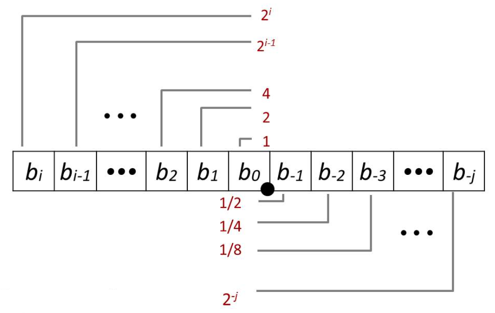
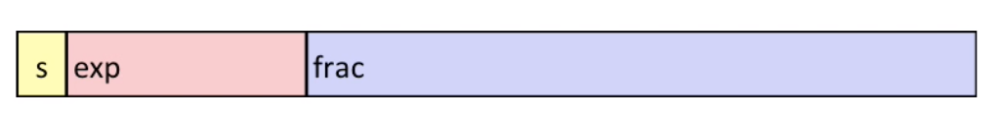
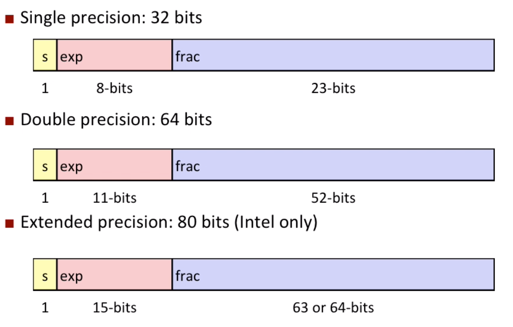
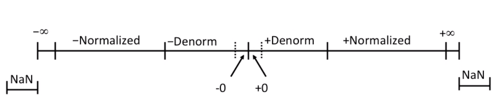
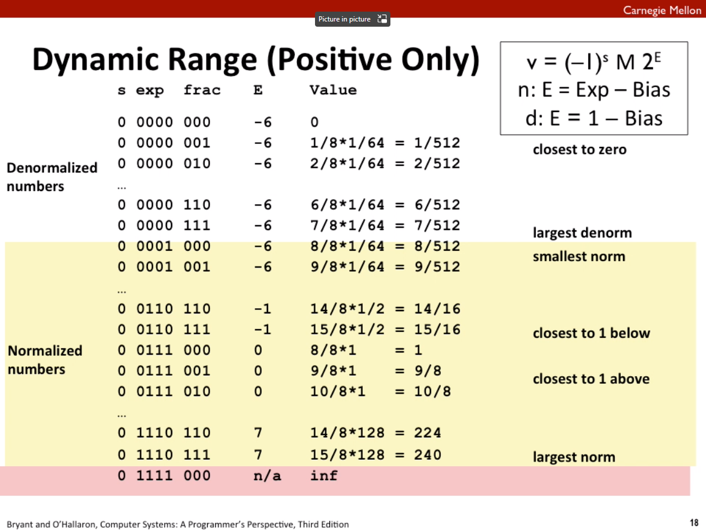
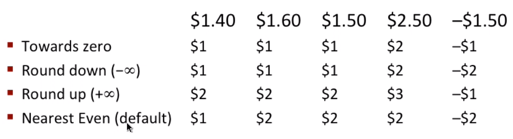
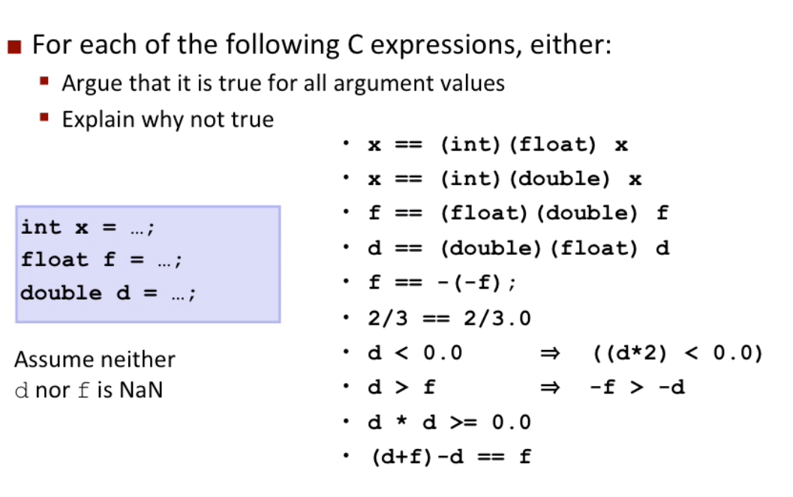

# Lecture 04 Floating Point

## Fractional Binary Numbers

Similar to the decimal fraction number, fraction point separate the number by two parts.  

**Limitation #1**

-   Can only exactly represent numbers of the form $x/2^k$
    -   Other rational numbers have repeating bit representations

**Limitation #2**

-   Just one setting of binary point within the $w$ bits
    -   Limited range of numbers (very small values? very large?)

## IEEE Floating Point

**IEEE Standard 754**

-   Established in 1985 as uniform standard for floating point arithmetic
    -   Before that, each machine may have different format.
-   Supported by all major CPUs

**Driven by numerical concerns**

-   Nice standards for rounding, overflow, underflow
-   Hard to make fast in hardware
    -   Numerical analysts predominated over hardware designers in defining standard. 

## Floating Point Representation

**Numerical Form:**
$$
(-1)^sM \cdot 2^E
$$

-   Sign bit $s$ determines whether number is negative or positive
-   Significand $M$ normally a fractional value in range [1.0, 2.0).
-   Exponent $E$ weights value by power of two

**Encoding**

-   MSB ` s` is sing bit $s$
-   `exp` field encodes $E$ (But not equal to $E$)
-   `frac` field encodes $M$ (But is not equal to $M$)

## Precision Options

## "Normalized" Values

When: `exp` $\neq 000..0$ and `exp` $\neq 111..1$

Exponent coded as a biased value: $E=\text{Exp} - \text{Bias}$

-   $\text{Exp}$: unsigned value of `exp` field
-   $\text{Bias}=2^{k-1}-1$, where k is number of exponent bits
-   **Remember: It represents the same range as two's complement number, but different representation. This "Bias" representation makes it easier to compare two different exponents** 

Significand coded with implied leading 1: $M = 1.\text{xxx...x}$

-   $\text{xxx...x}$: bits of `frac `field
-   Extra leading bit for "free"

## "Denormalized" Values

Condition: `exp`$=000..0$

Exponent value: $E=1-\text{Bias}$ (instead of $E=0-\text{Bias}$)

Significand coded with implied leading 0: $M=0.\text{xxx...x}$

Cases

-   `exp`$=000..0$, `frac`$=000..0$
    -   Represents zero value
    -   Note distinct values: +0 and -0
-   `exp`$= 000..0$, `frac`$\neq 000..0$
    -   Number closet to 0.0
    -   Equispaced

## Special Values

Condition: `exp`$= 111..1$

Cases

-   `exp`$= 111..1$, `frac`$=000..0$
    -   Represents value $\infin$
    -   Operation that overflows
    -   Both positive and negative
    -   E.g., $1.0 / 0.0 = -1.0 / -0.0 = +\infin$, $1.0 / -0.0 = -\infin$
-   `exp`$= 111..1$, `frac`$\neq 000..0$
    -   Not-a-Number (NaN)
    -   Represents case when no numeric value can be determined
    -   E.g., sqrt(-1), $\infin - \infin$, $\infin \cross 0$

## Visualization: Floating Point Encodings

Example here is using "tiny" floating point of 8 bits to represent the dynamic range of IEEE floating point. 

## Special Properties of the IEEE Encoding

FP zero same as integer zero

Can (almost) use unsigned integer comparison

-   Must first compare sign bits
-   Must consider $-0 = 0$
-   NaNs problematic
    -   Will be greater than any other values
    -   What should comparison yield?
-   Otherwise OK
    -   Denorm vs. normalized
    -   Normalized vs. infinity

## Floating Point Operations: Basic Idea

$$
x +_f y = \text{Round}(x + y)
$$

$$
x \cross_f y = \text{Round}(x \cross y)
$$

**Basic idea:**

-   First compute exact result
-   Make it fit into desired precision

## Rounding

**Rounding modes:**

Round-To-Even

-   When exactly halfway between two possible values
    -   Round so that least significant digit is even (not always up or down!)

## Mathematical Properties of FP Add

-    Yes/Almost
    -   Close under addition (but may generate infinity or NaN)
    -   Commutative
    -   Almost every element has additive inverse (except for infinities & NaNs)
    -   Monotonicity $a \geq b \Rightarrow a + c \geq b + c$ (Except for infinities & NaNs)

-   No
    -   Associative, because of possibility of overflow, inexactness of rounding

## Floating Point in C

Two levels in C

-   `float`     single precision
-   `double`     double precision

Conversions/Casting

-   Casting between `int`, `float`, and `double` changes bit representation
-   `double`/`float` --> `int`
    -   Truncates fractional part
    -   Like rounding toward zero
    -   Not defined when out of range or NaN: Generally sets to $T_{min}$
-   `int` --> `double`
    -   Exact conversion, as long as `int` has $\leq$ 53 bit word size
-   `int` --> `float`
    -   Will round according to rounding mode

## Floating Point Puzzles

1.   False, we don't have enough `frac` bit from `float` to `int`
2.   True, for `double` now we have enough `frac` bit
3.   True, we have enough `frac` bit
4.   False, we don't have enough bit
5.   True, only change sign bit
6.   False, different value
7.   True, even it overflows, $-\infin$ still less than 0

8.   True, only sign bit changed

9.   Ture
10.   False, lack of associativity
