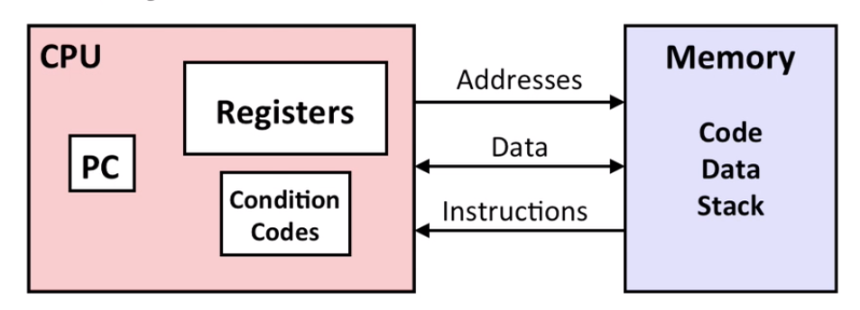

# Lecture 05 Machine-Level Programming I Basics

## Intel x86 Processors

Dominate laptop/desktop/server market

**Evolutionary design**

-   Backwards compatible up until **8086**, introduced in 1978

**Complex instruction set computer (CISC)**

-   Many different instructions with many different formats
    -   But, only small subset encountered with Linux programs. 
-   Hard to match performance of Reduced Instruction Set Computers (RISC)

## Intel x86 Evolution: Milestones


## x86 Clones: Advanced Micro Devices (AMD)

Historically

-   AMD has followed just behind intel
-   A little bit slower, a lot cheaper

Then

-   Recruited top circuit designer from Digital Equipment Corp. and other downward trending companies. 
-   Developed x86-64, their own extension to 64 bits

Recent Years

-   Intel got its act together
    -   Leads the world in semiconductor technology
-   AMD has fallen behind
    -   Relies on external semiconductor manufacturer

## Intel's 64-Bit History


>   Brief history on ARM: [ARM architecture family - Wikipedia](https://en.wikipedia.org/wiki/ARM_architecture_family)

## Definitions

**Architecture**: (also ISA: instruction set architecture) The parts of a processor design that one needs to understand or write assembly/machine code. 

**Microarchitecture**: Implementation of the architecture. 

Code Forms:

-   **Machine Code**: The byte-level programs that a processor executes
-   **Assembly Code**: A text representation of machine code

Example ISAs:

-   Intel: x86, IA32, Itanium, x86-64
-   ARM: Used in almost all mobile phones

>   [x86 assembly language - Wikipedia](https://en.wikipedia.org/wiki/X86_assembly_language)

## Assembly/Machine Code View



PC: Program counter

Register file: "Registers" 

Condition codes: Store status information about most recent arithmetic or logical operation

Memory: Byte addressable array

 ## Turning C into Object Code


Compiler -> Assembler -> Linker

## Assembly Characteristics: Data Types

"Integer" data of 1,2, 4, or 8 bytes

-   Data values
-   Addresses (untyped pointers)

Floating point data of 4, 8, or 10 bytes

Code: Byte sequences encoding series of instructions

No aggregate types such as arrays or structures

-   Just contiguously allocated bytes in memory

## Assembly Characteristics: Operations

Perform arithmetic function on register or memory data

Transfer data between memory and register

-   Load data from memory into register
-   Store register data into memory

Transfer control

-   Unconditional jumps to/from procedures
-   Conditional branches

## Disassembling Object Code

```bash
objdump -d XXX -M intel
```

Useful tool for examining object code

Analyzes bit pattern of series of instructions

Produces approximate rendition of assembly code

Can be run on either `a.out` (complete executable) or `.o` file

>   Some more (away) powerful disassemble tools that often used by reverse engineers and security researchers: IDA, Ghidra

## x86-64 Integer Registers


| Registers (`r*x`)     | Number of Bits     |
| --------------------- | ------------------ |
| `r*x`                 | 64                 |
| `e*x`                 | 32                 |
| `*x`                  | 16                 |
| `*l`                  | 8                  |
| **Registers (`r*i`)** | **Number of Bits** |
| `r*i`                 | 64                 |
| `e*i`                 | 32                 |
| `*i`                  | 16                 |
| `*il`                 | 8                  |
| **Registers (`r*`)**  | **Number of Bits** |
| `r*`                  | 64                 |
| `r*d`                 | 32                 |
| `r*w`                 | 16                 |
| `r*b`                 | 8                  |

## Some History: IA32 Registers

The reasons that some registers are named and some are numbered is that in the history of designing those registers, they serve different purpose. (But now most of the purpose may not the same)

| Registers | Origin (mostly obsolete) |
| --------- | ------------------------ |
| `eax`     | accumulate               |
| `ebx`     | counter                  |
| `ecx`     | data                     |
| `edx`     | base                     |
| `esi`     | source index             |
| `edi`     | destination index        |
| `esp`     | stack pointer            |
| `ebp`     | base pointer             |

## Moving Data

Moving Data

```assembly
movq Source, Dest
```

Operand Types

-   Immediate: Constant integer data
    -   `$0x400, $-533`
    -   Like C constant, but prefixed with `$`
    -   Encoded with 1, 2, or 4 bytes
-   Register: One of 16 integer registers
    -   `%rax, %r13`
    -   But `%rsp` reserved for special use (stack pointer)
    -   Others have special uses for particular instructions
-   Memory: 8 consecutive bytes of memory at address given by register
    -   `(%rax)`
    -   Various other "address modes"


## Simple Memory Addressing Modes


## Calling Convention

x86-64 function calling convention

`RDI, RSI, RDX, RCX, R8, R9`. Those registers respect to the first, second, third, ... parameters that input into the function. 

The return value, however, stored in the `RAX`. 

For example, when calling a function called `add()`. In `C` code, we may have:

```c
int add(int x, int y){
    return x + y;
}
```

In assembly, by the calling convention, `x, y` respect to register `rdi, rsi`. Return value (the sum) will store in the `RAX`. It may result following

```assembly
# Intel Syntax
add:
    mov rax, rdi
    add rax, rsi
    ret
    
# AT&T Syntax
add:
	movq %rdi, %rax
	addq %rsi, %rax
	retq;
```

## Complete Memory Addressing Modes


E.g.


## Some Arithmetic Operations


