# Lecture 06 Machine-Level Programming II Control

## Condition Codes (Implicit Setting)

Condition codes represent the state of most recent arithmetic instruction.  

Single bit registers

-   `CF` Carry Flag (for unsigned)
-   `SF` Sign Flag (for signed)
-   `ZF` Zero Flag
-   `OF` Overflow Flag (for signed)

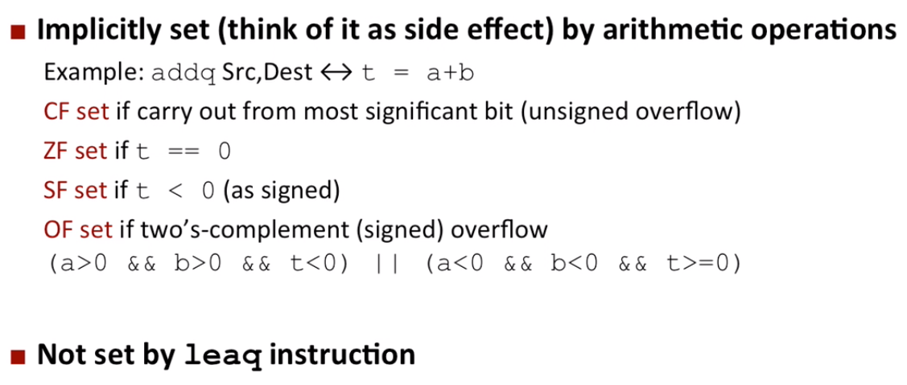

## Condition Codes (Explicit Setting: Compare)

Explicit Setting by Compare Instruction

```assembly
cmpq SRC2, SRC1
```

`cmpq b, a` a like computing `a - b` without setting destination

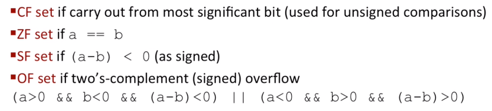

## Condition Codes (Explicit Setting: Test)

Explicit Setting by Test Instruction

```assembly
testq SRC2, SRC1
```

`testq b, a` a like computing `a & b` without setting destination

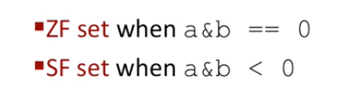

## Reading Condition Codes

SetX Instructions

-   Set low-order byte of destination to 0 or 1 based on combinations of condition codes
-   Does not alter remaining 7 bytes

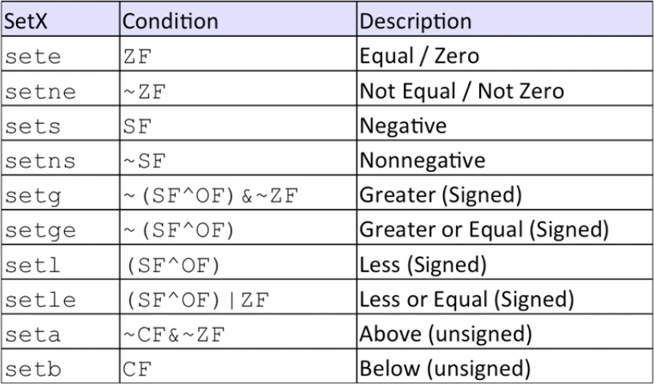

## Jumping

jX Instructions

-   Jump to different part of code depending on condition codes

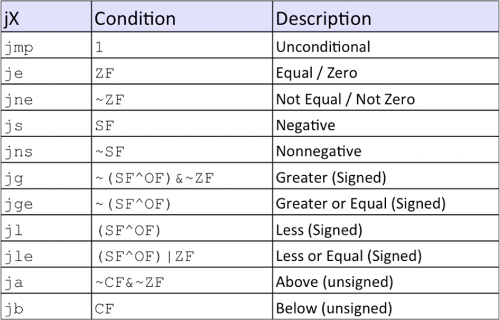

## Expressing with Goto Code

C allows `goto` statement

Jump to position designated by label (more like an assembly code structure)

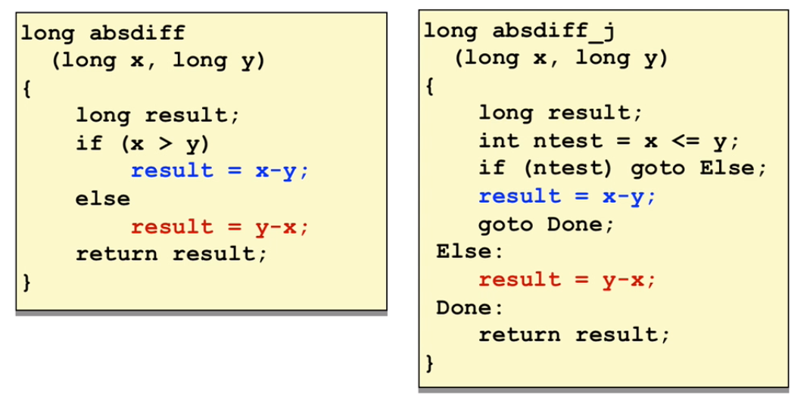

## Using Conditional Moves

Conditional Move Instructions

-   Instruction supports:

```
if (Test) Dest <- Src
```

-   Supported in post-1995 x86 processors
-   GCC tries to use them 
    -   But, only when known to be safe

Why?

-   Branches are very disruptive to instruction flow through pipelines
-   Conditional moves do no require control transfer

E.g.

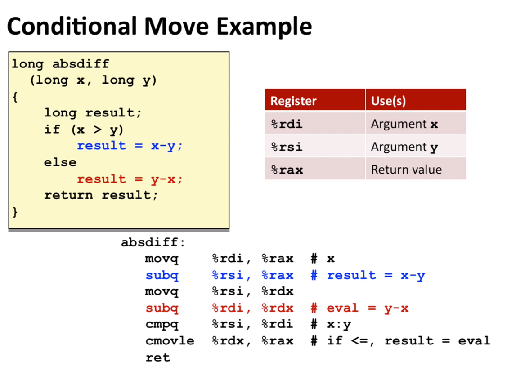

## Bad Cases for Conditional Move

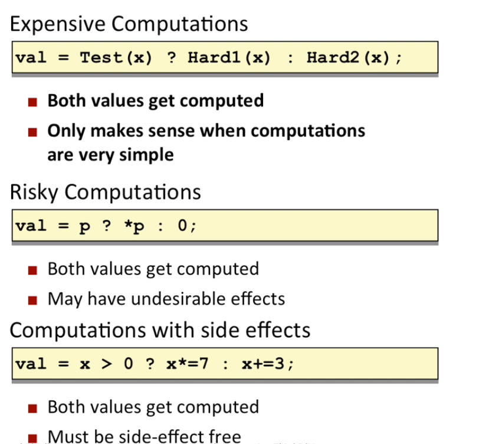

## "Do-While" Loop Example

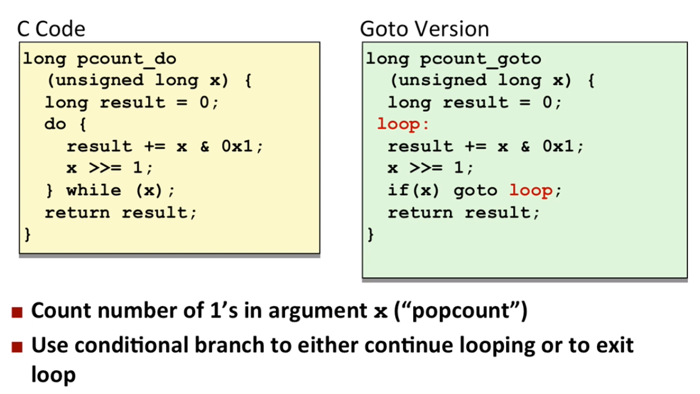

## General "Do-While" Translation

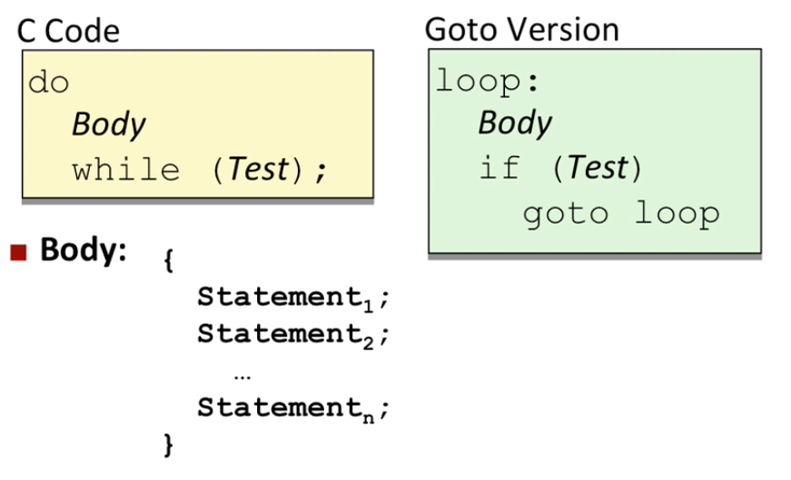

## General "While" Translation \#1

"Jump-to-middle" translation

Used with `-Og`

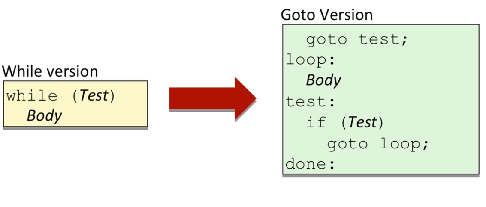

E.g.

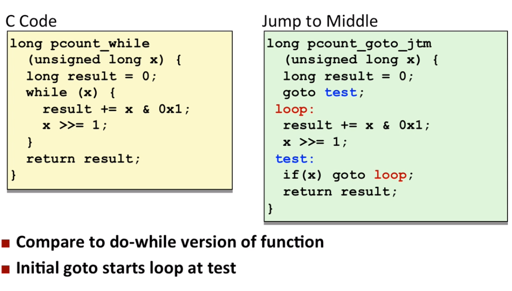

## General "While" Translation \#2

"Do-while" conversion

Used with `-O1`

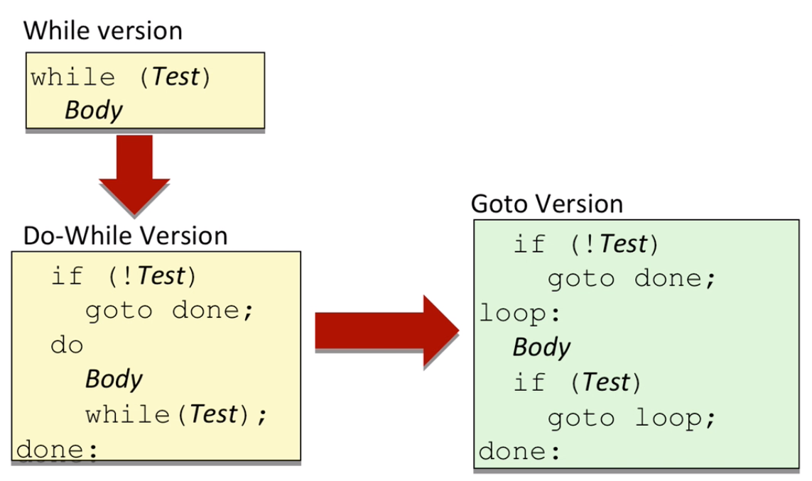

## "For" Loop Form

Usually, we translate a "For" loop to a while loop. They have exactly the same behavior.

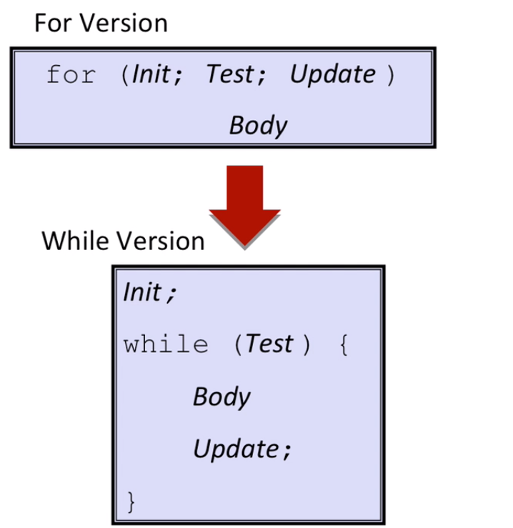

## Switch Statement

C uses jump table structure to implement switch statement. 

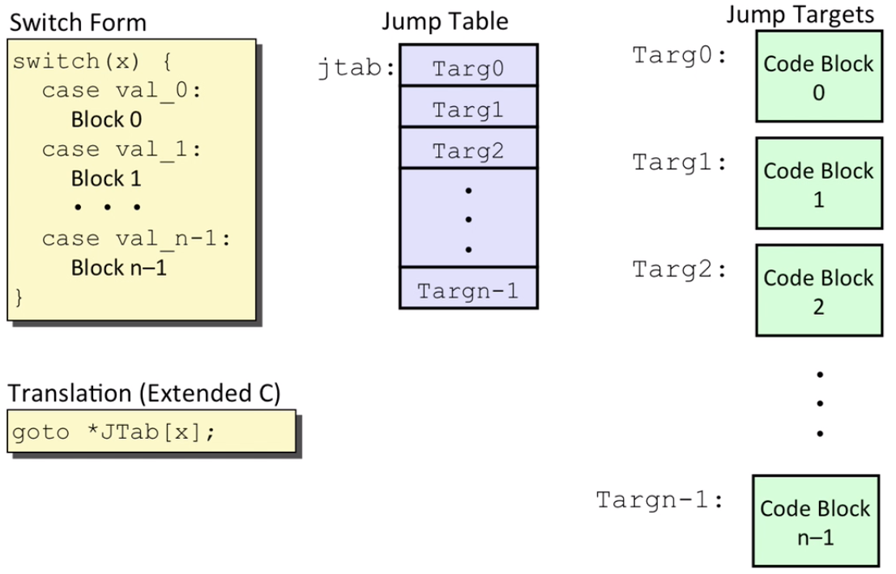

At the beginning of the switch statement, it first check the argument jump to the default behavior (too small or too large). 

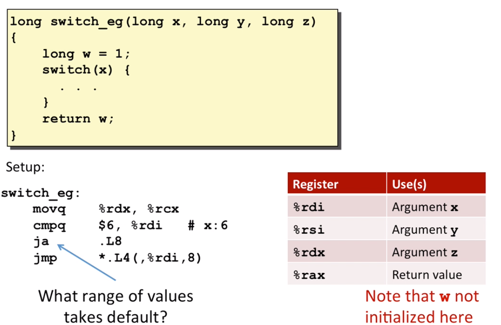

Then, it will implement an unconditional jump to the jump table with the index of the argument. 

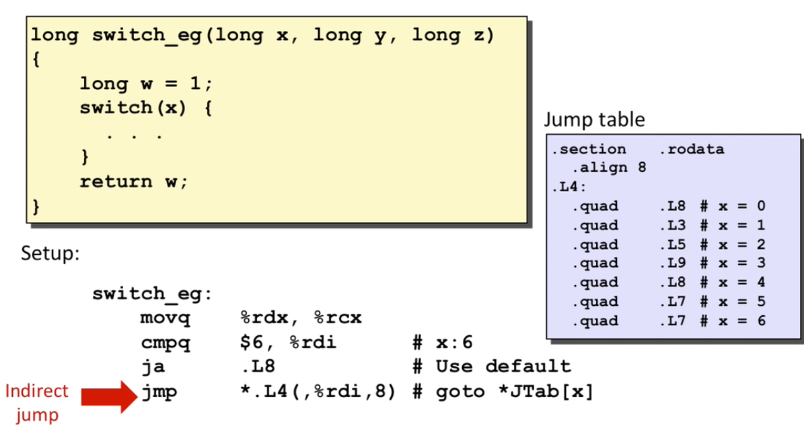

The jump table:

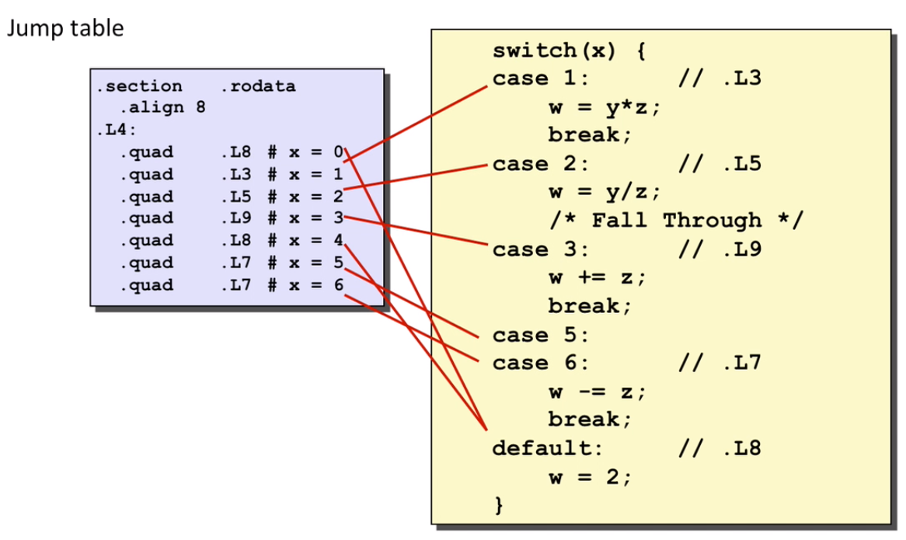


