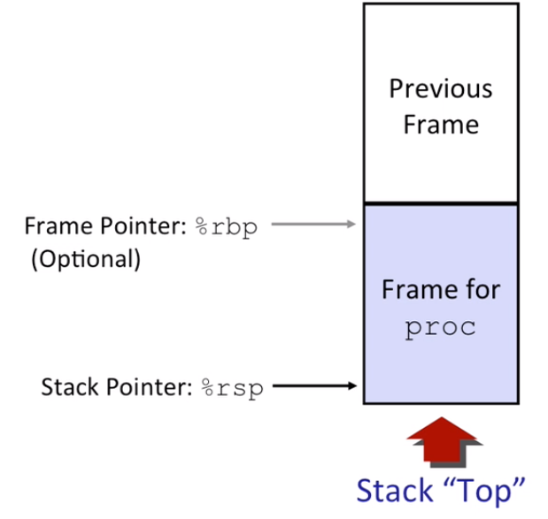

# Lecture 07 Machine-Level Programming III Procedures

## Mechanisms in Procedures

**Passing Control**

-   To beginning of procedure code
-   Back to return point

**Passing data**

-   Procedure arguments
-   Return value

**Memory management**

-   Allocate during procedure execution
-   Deallocate upon return

**Mechanisms all implemented with machine instructions**

**x86-64 implementation of a procedure uses only those mechanisms required**

## x86-64 Stack

Stack is a Region of memory managed with stack discipline

It grows toward lower addresses

Stack pointer `%rsp` pointing to the top of the stack

**Stack operations:**

-   Push `pushq Src`
    -   Fetch operand at `Src`
    -   Decrement `%rsp` by 8
    -   Write operand at address given by `%rsp`
-   Pop `popq Dest`
    -   Read value at address given by `%rsp`
    -   Increment `%rsp` by 8
    -   Store value at `Dest` (must be register)

## Procedure Control Flow

Use stack to support procedure call and return

Procedure call: `call label`

-   Push return address on stack
-   Jump to label

Return address:

-   Address of the next instruction right after call

Procedure return: `ret`

-   Pop address from stack
-   Jump to address

>   Remember, `call/ret` do not do the whole thing when calling the procedure, they only manage the control part. 

## Procedure Data Flow

## Stack-Based Languages

Languages that support recursion

-   E.g., C, Pascal, Java
-   Code must be "Reentrant"
    -   Multiple simultaneous instantiations of single procedure

-   Need some place to store state of each instantiation
    -   Arguments
    -   Local variables
    -   Return pointer

Stack discipline

-   State for given procedure needed for limited time
    -   From when called to when return
-   Callee returns before caller does

Stack allocated in **Frames**

-   state for single procedure instantiation

## Stack Frames

>   Some times `%rbp` will be used as a stack base pointer which indicates the base of the stack frame. 

Contents

-   Return information
-   Local storage (if needed)
-   Temporary space (if needed)

Management

-   Space allocated when enter procedure
    -   "Set-up" code
    -   Includes push by `call` instruction
-   Deallocated when return
    -   "Finish" code
    -   Includes pop by `ret` instruction

## x86-64/Linux Stack Frame

Current Stack Frame ("Top" to Bottom)

-   "Argument build:"

    Parameters for function about to call

-   Local variables

    If can't keep in registers

-   Saved register context

-   Old frame pointer (optional)

Caller Stack Frame

-   Return address
    -   Pushed by `call` instruction
-   Arguments for this call

## Register Saving Conventions

When procedure `yoo` calls `who`:

-   `yoo` is the **caller**
-   `who` is the **callee**

Can register be used for temporary storage?

Answer is NO! The callee may mess up the registers and rewrite another value.

**Conventions** 

-   Caller saved
    -   Caller saves temporary values in its frame before the call
-   Callee saved
    -   Callee saves temporary values in its frame before using
    -   Callee restores them before returning to caller

**Caller Saved Registers**

**Callee Saved Registers**

## Observations About Recursion

Handled Without Special Consideration

-   Stack frames mean that each function call has private storage
    -   Saved registers & local variables
    -   Saved return pointer
-   Register saving conventions prevent one function call from corrupting another's data
    -   Unless the C code explicitly does so (E.g., buffer overflow)
-   Stack discipline follows call/return pattern
    -   If P calls Q, then Q returns before P
    -   Last-In, First-Out

Also works for mutual recursion

-   P calls Q; Q calls P

