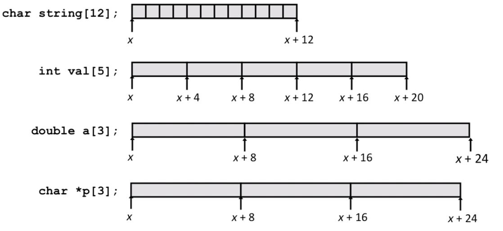
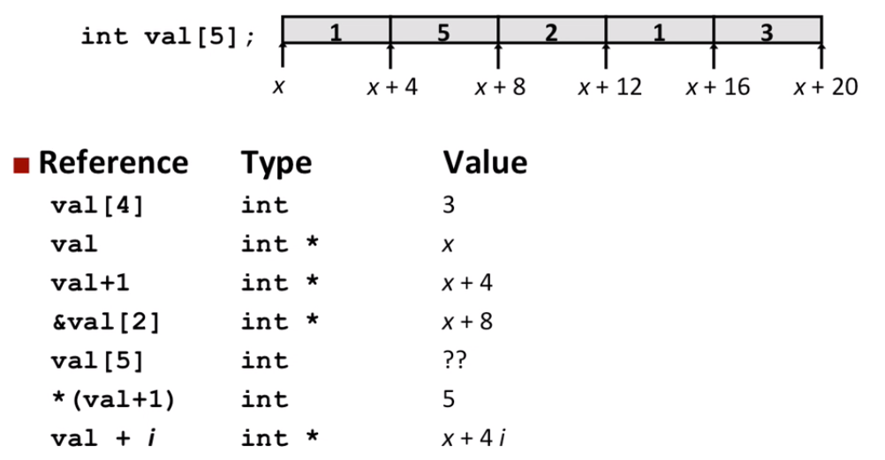
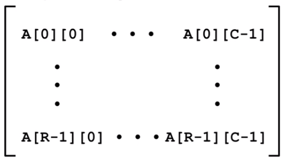
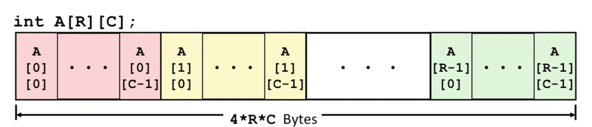
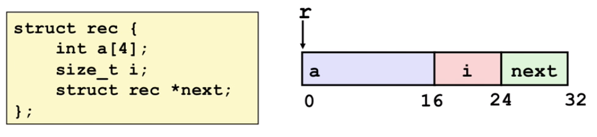
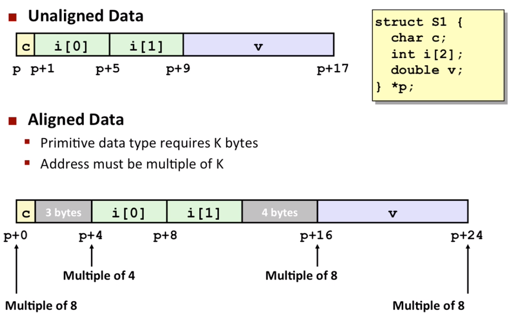

# Lecture 08 Machine-Level Programming IV Data

## Array Allocation

Basic Principle

```
T A[L];
```

-   Array of data type `T` and length `L`
-   Contiguously allocated region of `L * sizeof(T)` bytes in memory



## Array Access

Basic Principle

```
T A[L];
```

-   Array of data type `T` and length `L`
-   Identifier `A` can be used as a pointer to array element 0: Type `T*`

>   Array is a pointer. Pointer can be seen as array



## Multidimensional (Nested) Arrays

Declaration

```
T A[R][C];
```

-   2D array of data type `T`
-   `R` rows, `C` columns
-   Type `T` element requires `K` bytes

Array Size

-   `R * C * K` bytes

Arrangement

-   Row-Major Ordering





## Nested Array Row Access

Row Vectors

-   `A[i]` is array of `C` elements
-   Each element of type `T` requires `K` bytes
-   Starting address `A + i * (C * K)`

Array Elements

-   `A[i][j]` is element of type `T`, which requires `K` bytes
-   Address `A + i * (C * K) + j * k = A + (i * C + j) * K`

## Structure Representation



Structure represented as block of memory

-   Big enough to hold all of the fields

Fields ordered according to declaration

-   Even if another ordering could yield a more compact representation

Compiler determines overall size + positions of fields

-   Machine-level program has no understanding of the structures in the source code

Generating Pointer to Array Element

-   Offset of each structure member determined at compile time

## Structures & Alignment



## Alignment Principles

Aligned Data

-   Primitive data type required `K` bytes
-   Address must be multiple of `K`
-   Required on some machines; advised on x86-64

Motivation for Aligning Data

-   Memory accessed by (aligned) chunks of 4 or 8 bytes (system dependent)
    -   Inefficient to load or store datum that spans quad word boundaries
    -   Virtual memory trickier when datum spans 2 pages

Compiler 

-   Inserts gaps in structure to ensure correct alignment of fields


