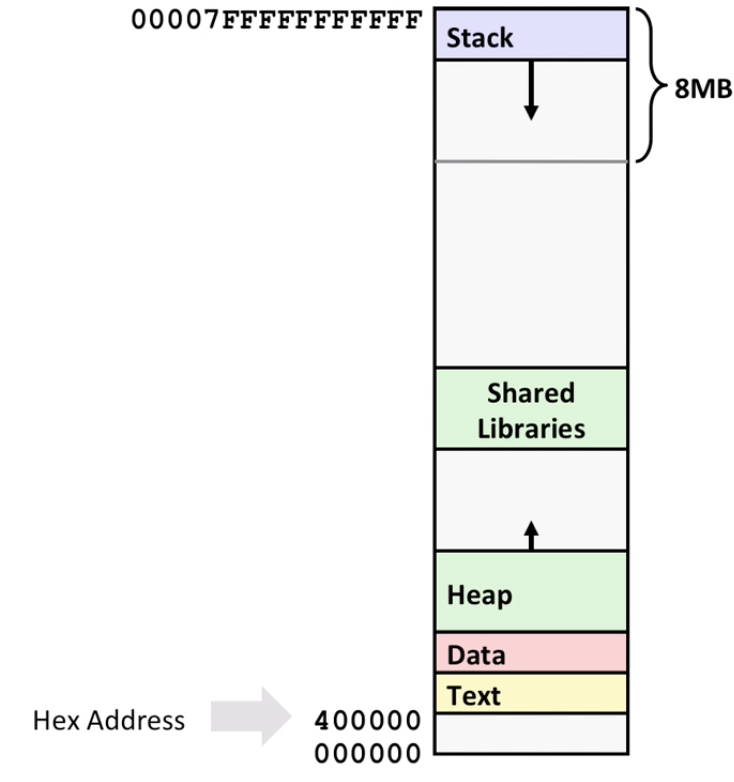
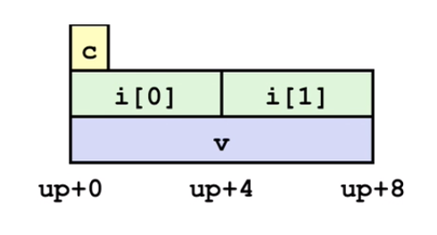
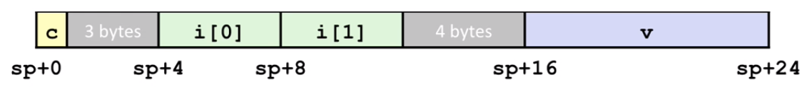

# Lecture 09 Machine-Level Programming V Advanced Topics

## x86-64 Linux Memory Layout

Stack

-   Runtime stack (8MB limit)
-   E.g., local variables

Heap

-   Dynamically allocated as needed
-   When call `malloc()`, `calloc()`, `new()`

Data

-   Statically allocated data
-   E.g., global vars, `static` vars, string constants

Text / Shared Libraries

-   Executable machine instructions
-   Read-only

## Buffer Overflow

This happens when exceeding the memory size allocated for an array.

It's the #1 technical cause of security vulnerabilities

-   #1 overall cause is social engineering / user ignorance

Most common form

-   Unchecked lengths on string inputs
-   Particularly for bounded character arrays on the stack
    -   Sometimes referred to as stack smashing

## Code Injection Attacks

Buffer overflow problem may cause code injection attacks. Hackers may inject their own code and overwrite return address to jump to where their code's location to exploit the program.  

## Aside: Worms and Viruses

Worm: A program that

-   Can run by itself
-   Can propagate a fully working version of itself to other computers

Virus: Code that

-   Adds itself to other programs
-   Does not run independently

Both are (usually) designed to spread among computers and to wreak havoc

**Avoid Overflow Vulnerabilities in Code (!)**

-   Use library routines that limit string lengths

**System-Level Protections can help**

-   Randomized stack offsets or ASLR (Address Space Layout Randomization)
-   Nonexecutable code segments (usually stack)

**Stack canary**

-   Place special value ("canary") on stack just beyond buffer
-   Check for corruption before exiting function

## Return-Oriented Programming Attacks

Challenge

-   Stack randomization makes it hard to predict buffer location
-   Marking stack nonexecutable makes it hard to insert binary code

Alternative Strategy

-   Use existing code
    -   E.g., library code from stdlib
-   String together fragments to achieve overall desired outcome
-   *Does not overcome stack canaries*

Construct program from gadgets

-   Sequence of instructions ending in `ret`
-   Code positions fixed (can be relative fixed) from run to run
-   Code is executable

## Union Allocation

Allocate according to largest element

Can only use **one field** at a time, otherwise may mess up the data

`struct`: 

