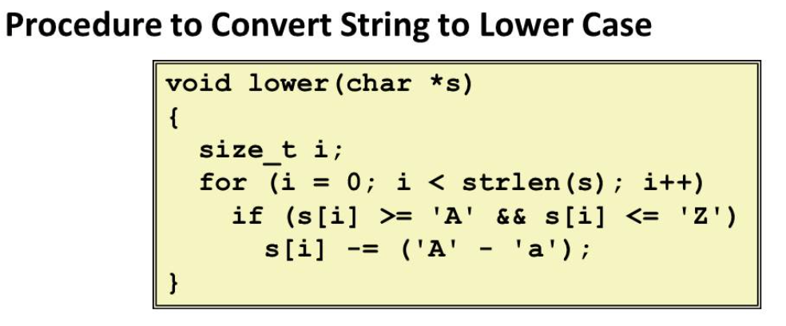
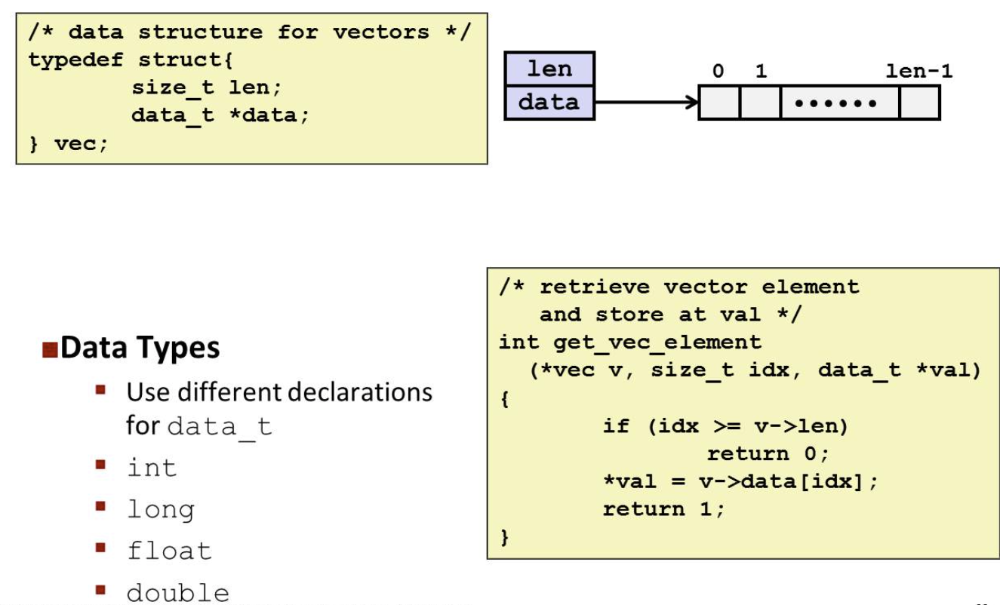

# Lecture 10 Program Optimization

## Optimizing Compilers

Number 1 compiler rule: **When in doubt, the compiler must be conservative**

This constrain a lot for compilers to do some "proper" optimizations on a set of code. 

## Generally Useful Optimization

Optimizations that you or the compiler should do regardless of processor/compiler

**Reduction in Strength**

-   Replace costly operation with simpler one

-   Shift, add instead of multiply or divide

-   Recognize sequence of products
-   Share common subexpressions
    -   Reuse portions of expressions

## Optimization Blocker #1: Procedure Calls

Take a look at this piece of code:

Quadratic performance of this code

The reason why it have this poor performance is because `strlen` executed every iteration. `strlen` it self takes linear time of the input. 

Therefore the overall performance result to be $O(n^2)$. The way to improve it is to extract it out of the loop since its output is constant

**Why couldn't compiler move `strlen` out of inner loop?**

-   Procedure may have side effect
    -   Alters global state each time called
-   Function may not return same value for given arguments
    -   Depends on other parts of global state
    -   Procedure `lower` could interact with `strlen`

**Warning:**

-   Compiler treats procedure calls as a black box
-   Weak optimizations near them

## Optimization Blocker #2: Memory Aliasing

**Aliasing**

-   Two different memory references specify single location
-   Easy to have happen in C
    -   Since allowed to d address arthmetic
    -   Direct access to storage structures
-   Get in habit of introducing local variables
    -   Accumulating within loops
    -   **Your way of telling compiler not to check for aliasing**

## Exploiting Instruction-Level Parallelism

Need general understanding of modern processor design

-   Hardware can execute multiple instructions in parallel

Performance limited by data dependencies

Simple transformations can yield dramatic performance improvement

-   Compilers often cannot make these transformations
-   Lack of associativity and distributivity in floating-point arithmetic

E.g.

## Cycles Per Element (CPE)

Convenient way to express performance of program that operates on vectors or lists
$$
T = \text{CPE} \cdot n + \text{Overhead}
$$
Some basic optimizations

## Modern CPU Design

## Superscalar Processor

## Pipelined Functional Unites

## Loop Unrolling (2x1)

## Unrolling & Accumulating: Double \*

## Branches

Modern computer predict where the branch will go and continue working on the prediction route. But this action won't modify register or memory data. So if the guess failed, it can fix easily fix it but waste the clock cycles that doing on the wrong route.

If the prediction invalid:

Misprediction Recovery

## Getting High Performance

