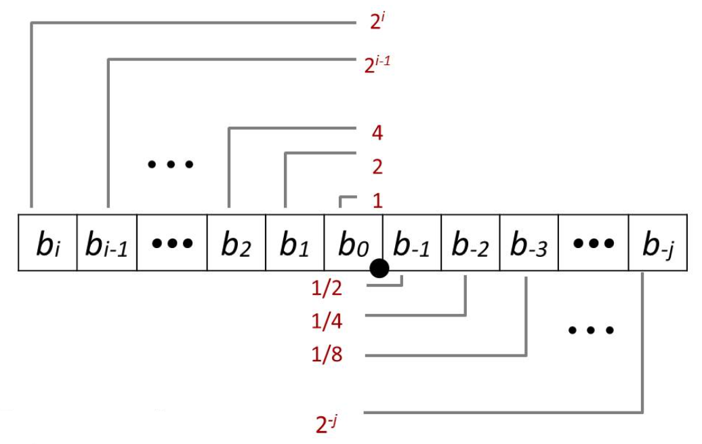

# Recitation 1 Datalab and Data Representations

The recitation on the datalab. 

## Integers - Biasing

Multiply/divide powers of 2 with shift:

-   Multiply
    -   Left shift by $k$ to multiply by $2^k$
-   Divide
    -   Right shift by $k$ to divide by $2^k$
    -   Remember right shift have **arithmetic shift** and **logical shift**. 

But shifting rounds towards -INF, but we want to round to 0.

So the solution is to biasing when negative. To add $2^k - 1$ as the bias. 

## Integers - Endianess

Endianess describes which bit is most significant in binary number. There are total two of them:

For a number `0x12345678`

-    Big endian: 
    -   First byte (lowest address) is the *most* significant
    -   This is how we typically talk about binary nubmers
    -   It represent the number as: `12 34 56 78` in memory
-   Little endian:
    -   First byte (lowest address) is the *least* significant
    -   Intel x86 implement this
    -   It represent the number as: `78 56 34 12` in memory

## Floating Point - Fractions in Binary

Bits to right of "binary point" represent fractional powers of two

Represents rational number: 
$$
\sum_{k=-j}^i b_k \cross 2^k
$$

## Floating Point - IEEE Standard

Representation

We can think of floating point as binary scientific notation

-   IEEE format includes a few optimizations to increase range for our given number of bitts
-   The number represented is essentially (`sign * frac * 2^exp`)

