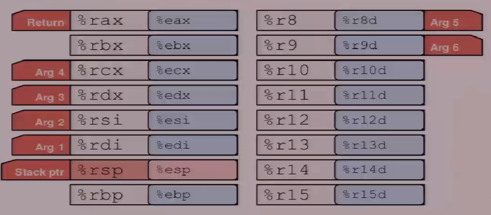
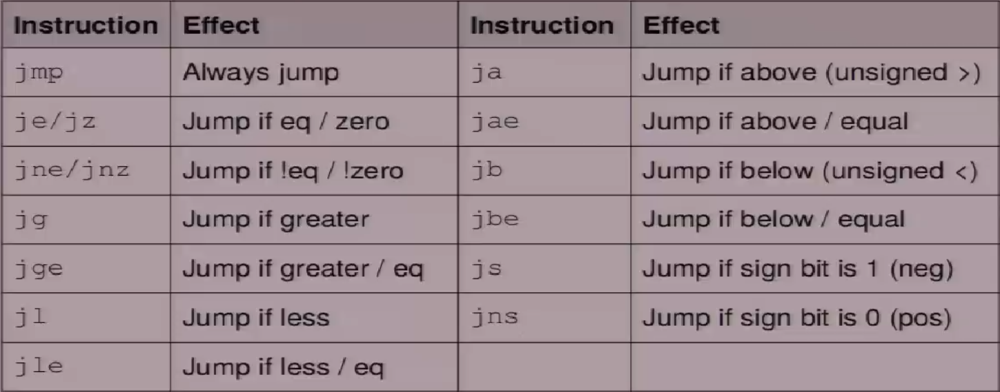

# Recitation 4 Bomb Lab

The recitation on the bomblab. 

## x64 Assembly: Registers



## x64 Assembly: Operands

| Type             | Syntax                                              | Example                                        | Notes                                              |
| ---------------- | --------------------------------------------------- | ---------------------------------------------- | -------------------------------------------------- |
| Constants        | Start with `$`                                      | `$042`, `$0x15213b`                            | Don't mix up decimal and hex                       |
| Registers        | Start with `%`                                      | `%esi`, `%rax`                                 | Can store values or addresses                      |
| Memory Locations | Parentheses around a register or an addressing mode | `(%rbx)`, `0x1c(%rax)`, `0x4(%rcx, %rdi, 0x1)` | Parentheses dereference. Look up addressing modes! |

## x64 Assembly: Arithmetic Operations

| Instruction                 | Effect                                      |
| --------------------------- | ------------------------------------------- |
| `mov %rbx, rdx`             | `rdx = rbx`                                 |
| `add (%rdx), %r8`           | `r8 += value at rdx`                        |
| `mul $3, %r8`               | `r8 *= 3`                                   |
| `sub $1, %r8`               | `r8--`                                      |
| `lea (%rdx, %rbx, 2), %rdx` | `rdx = rdx + rbx * 2` (Doesn't dereference) |

## x64 Assembly: Comparisons

Comparison, `cmp`, compares two values

-   Result determines next conditional  instruction

```assembly
cmp b, a
```

`cmp` computes `a - b`

```assembly
test b, a
```

`test` computes `a & b`

> Remember: pay attention to operands **order**

## x64 Assembly: Jumps




