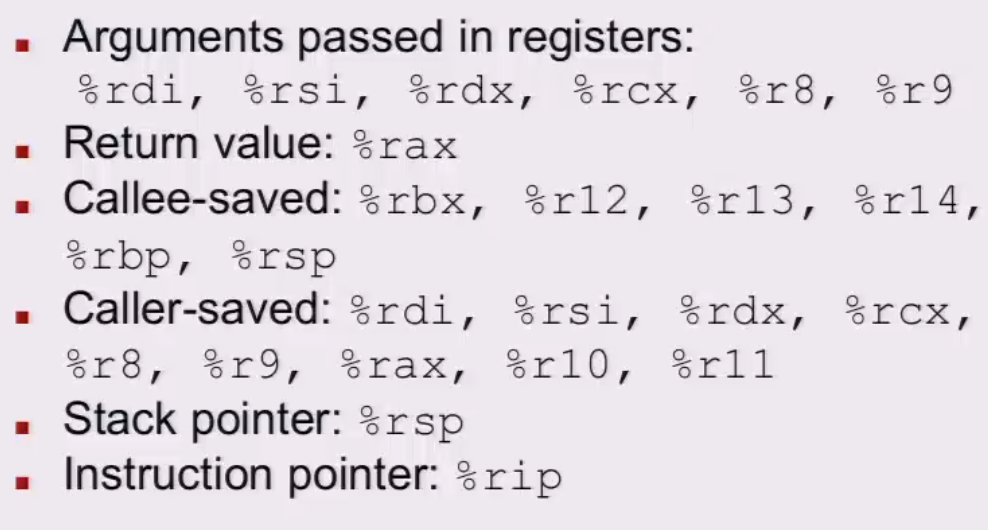
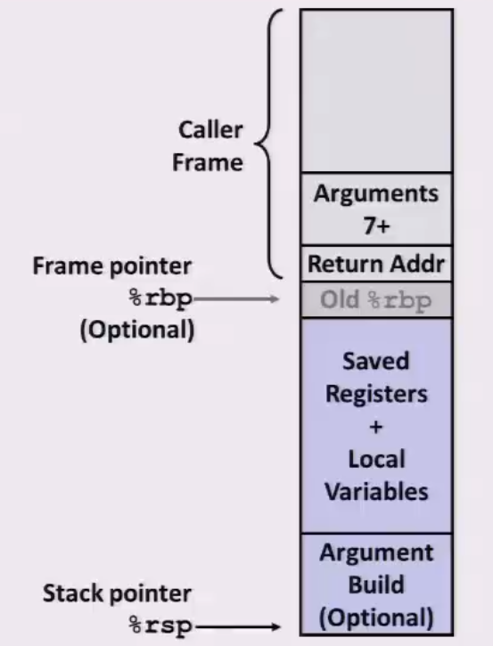

# Recitation 3 Attack Lab and Stacks

## x86-64 Register Conventions

## x86-64 The Stack

Stack grows **downward** towards lower memory addresses

`%rsp` points to **top** of the stack

## x86-64 Stack Frames

Every function call has its own **stack frame**

It is like a workspace for each function

