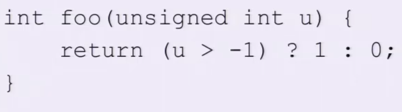
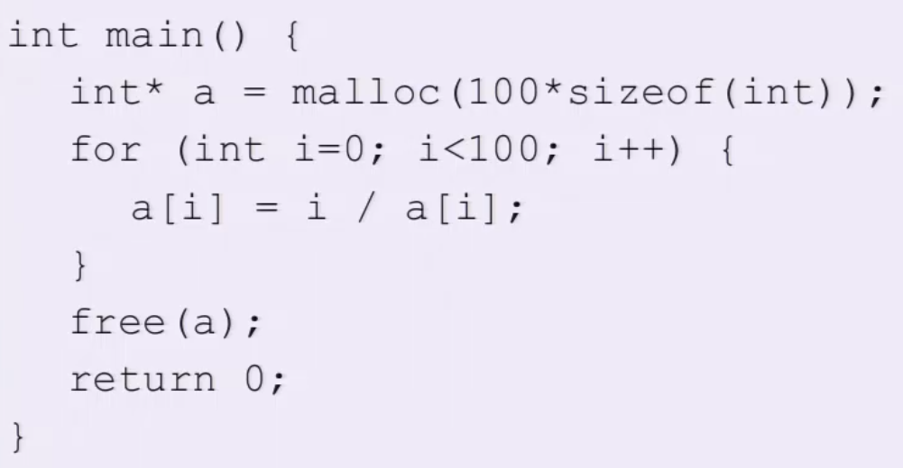
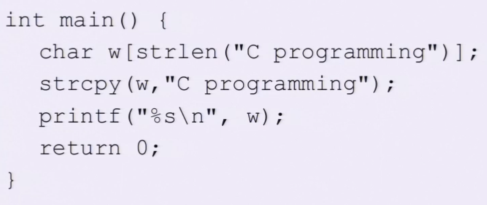
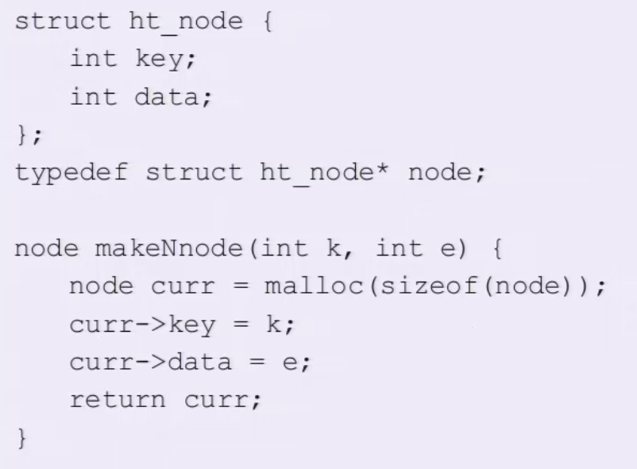
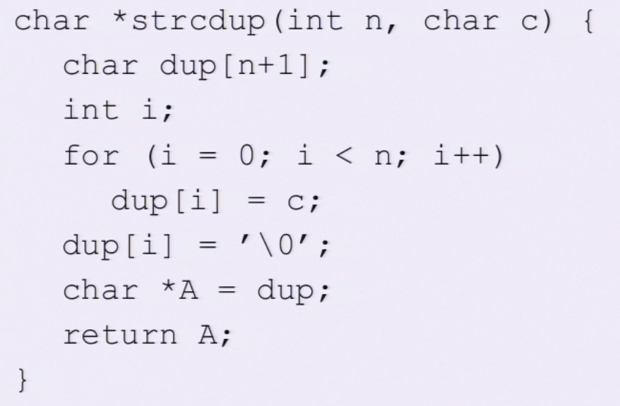
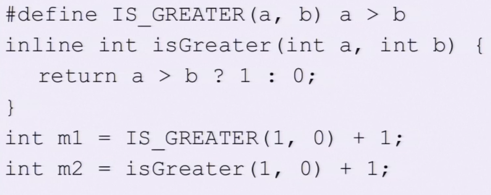
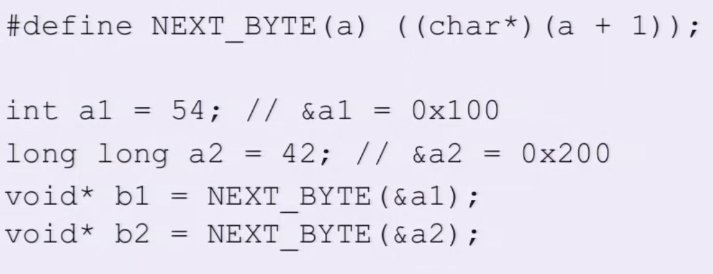
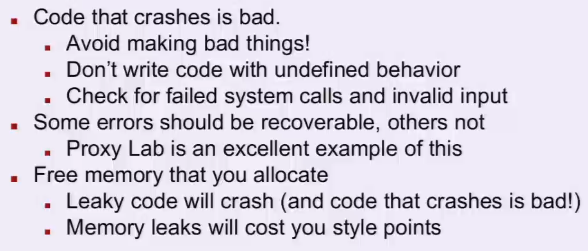
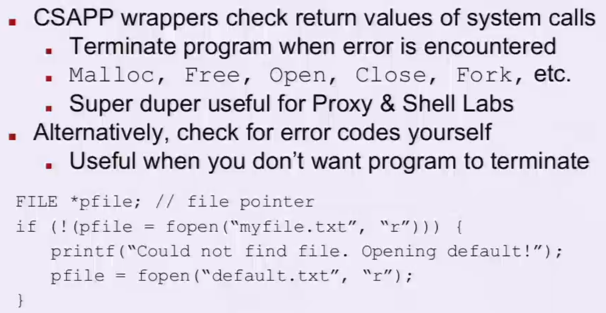

# Recitation 4 C Review

## Some warning about C

It's possible to write bad code. Don't 

Watch out for implicit casting

Watch out for undefined behavior

Watch out for memory leaks.

Macros and pointer arithmetic can be tricky

K&R is the official reference on how things behave

## C-0



Because input `u` is a `unsigned int`. So everything will be cased to unsigned. Which means that `-1` will be cast to `0xfff...f`. 

## C-1



No vale in `a` was initialized. `malloc` will have something leftover from last user to use. 

## C-2



The buffer initialized with the length that does not include the null terminator. So when doing this `strcpy`, it will overflow 1 byte to somewhere else outside of the bound. 

## C-3



It doesn't free the memory allocated in the function. Also, `node` is a `typedef` to a `struct ht_node*` which is a pointer, not the actual struct. So `malloc` could return 4 or 8 depending on system word size. 

## C-4



The `char` array `dup` is locate inside the function, which means that it is in the stack. But what we return is a pointer. Stack will be destroyed after return and reallocate by other functions

## C-5*



`IS_GREATER` is a macro that is not wrapped in parentheses. `m1` will actually evaluate to `0`, since `1 > 0 + 1 -> 1 > (0 + 1) -> 1 > 1 = 0 (false)`. The macro just replace the itself by expression of `a > b`.  

## C-6



The macro here is doing casting after 1 added to pointer `a`. So the amount of adding will depend on what's the original type are. Therefore `b1` is a void pointer to the address `0x104`, `b2` will be `0x208`

## The C Standard Library

```c
#include <stdlib.h>
```

Use it wisely! 

Don't write code that's already been written!

-   You work might have a bug or lack features

All C standard Library functions are documented

-   Use the UNIX `man` command to look up usage

## Robustness





## Quick C Tip: `getopt`

Used for parsing command-line arguments

Don't write your own code for this. Not worth it.

-   In fact, we actively discourage it
-   Autograder randomizes argument order


